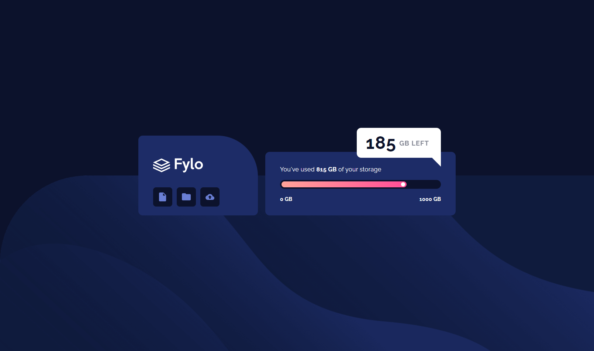
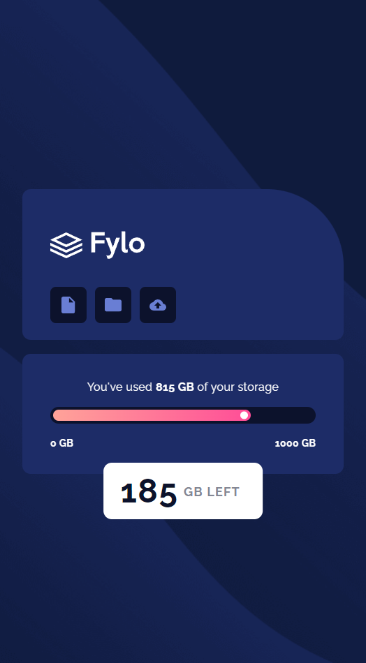

# Data storage component solution

This is a solution to the [Fylo data storage component challenge on Frontend Mentor](https://www.frontendmentor.io/challenges/fylo-data-storage-component-1dZPRbV5n). 

## Table of contents

- [Overview](#overview)
    - [The challenge](#the-challenge)
    - [Screenshot](#screenshot)
    - [Links](#links)
- [My process](#my-process)
    - [Built with](#built-with)
- [Author](#author)

## Overview

### The challenge

Users should be able to:

- View the optimal layout for the site depending on their device's screen size

### Screenshot

### Links

- Live Site URL: [Demo](https://ilyachichkov.github.io/storage-amount-component/)

## My process

### Built with

- Semantic HTML5 markup
- CSS custom properties
- Flexbox
- Mobile-first workflow
- [VUE](https://vuejs.org/) - VUE framework
- [TailwindCSS](https://tailwindcss.ru/) - For styles

### Useful resources

- [Google Fonts](https://fonts.google.com/)

## Author

- Frontend Mentor - [@IlyaChichkov](https://www.frontendmentor.io/profile/IlyaChichkov)
